# 🎵 Android 音乐播放器（KMusic）

一款基于 Flutter 开发的安卓音乐播放器，专注于**本地音乐管理 + 多音源播放 + 丰富音效体验**，同时兼顾个性化与可扩展性。

---

## ✨ 功能特色

### 🎧 多音源支持

* 支持本地音乐播放
* 集成多平台在线音源：

  * 酷我音乐
  * 哔哩哔哩
  * 网易云
* 广播电台支持：

  * 云听
  * 蜻蜓FM
  * 喜马拉雅

---

### 🎚 强大的音效系统

全面支持 Android 原生音频增强能力：

* 均衡器（Equalizer / DynamicsProcessing）
* 低音增强（BassBoost）
* 虚拟环绕（Virtualizer）
* 混响效果（PresetReverb / EnvironmentalReverb）

带来更沉浸的听觉体验 🎶

---

### 🎨 个性化主题

* 支持自定义主题
* 动态主题切换
* 背景流光效果（提升视觉氛围）

让播放器更符合你的审美风格

---

### 🎤 歌词体验升级

* 支持逐字歌词（精细同步）
* 蠕动歌词动效（流畅展示）
* 桌面歌词（边听边看）

---

### 📥 音乐管理能力

* 支持音乐下载
* 本地音乐文件标签编辑（Meta 信息修改）

---

### 💾 数据管理

* 支持数据库备份与恢复
* 支持设置项迁移

方便换设备或重装后快速恢复使用

---

### 📊 实验性功能

* 音频可视化（Audio Visualization）

---

### 🔍 智能匹配

* 在线匹配歌词与封面图片

---

## 🚀 技术特点

* 使用 Flutter 构建，跨平台架构清晰
* 深度结合 Android 原生音频能力
* 模块化设计，便于扩展音源与功能

---

## 🙏 致谢

感谢项目：

* 音乐标签处理：
  [https://pub.dev/packages/metatagger](https://pub.dev/packages/metatagger)

* 哔哩哔哩接口：
  [https://github.com/Nemo2011/bilibili-api](https://github.com/Nemo2011/bilibili-api)

* 背景流光效果：
  [https://www.shadertoy.com/view/wdyczG](https://www.shadertoy.com/view/wdyczG)
* 网易云API:
  [https://github.com/rRemix/APlayer](https://github.com/rRemix/APlayer)
* 网易云VIP歌曲解析:
  [https://api.qijieya.cn/meting/](https://api.qijieya.cn/meting/)

---

## 📌 说明

本项目仅用于学习与交流，请遵守相关平台的使用规范与版权政策。

---

---
## 📱 应用截图

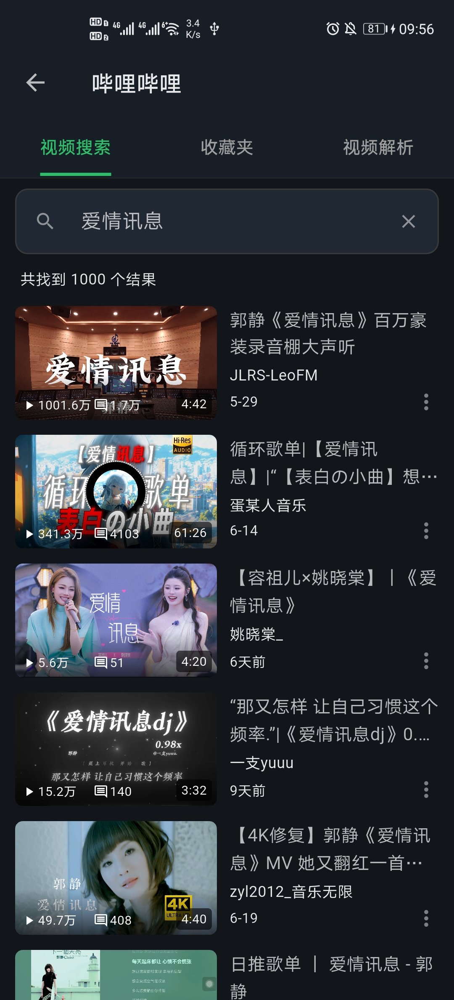
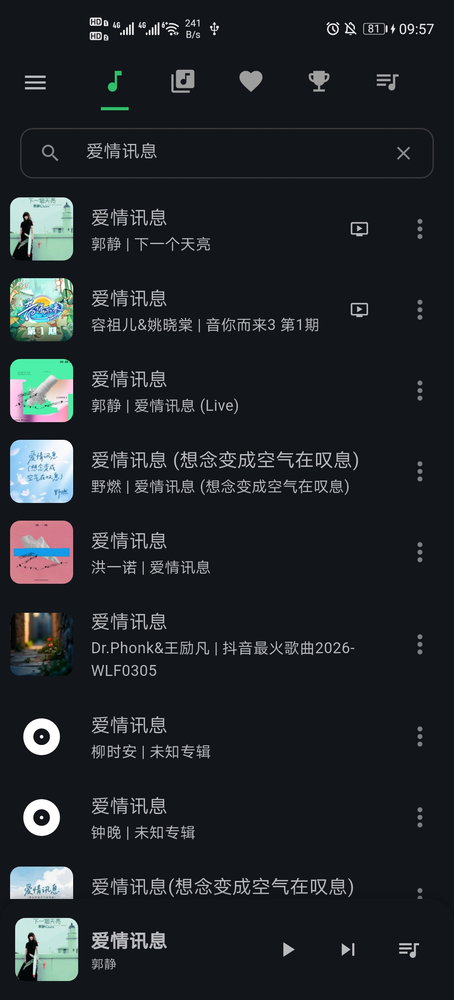
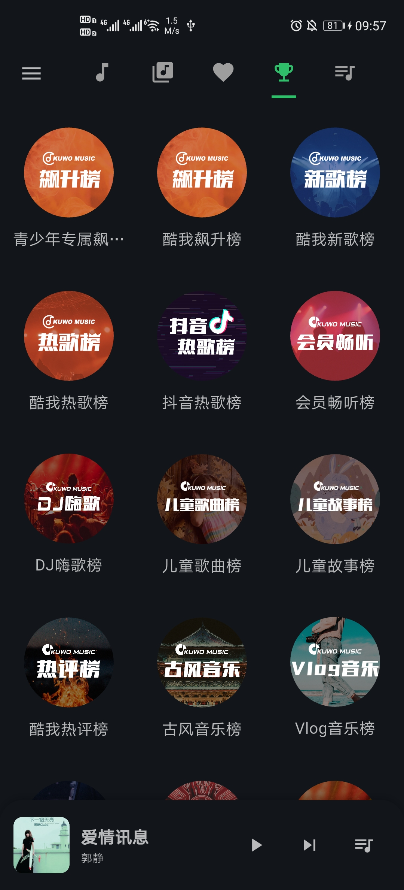
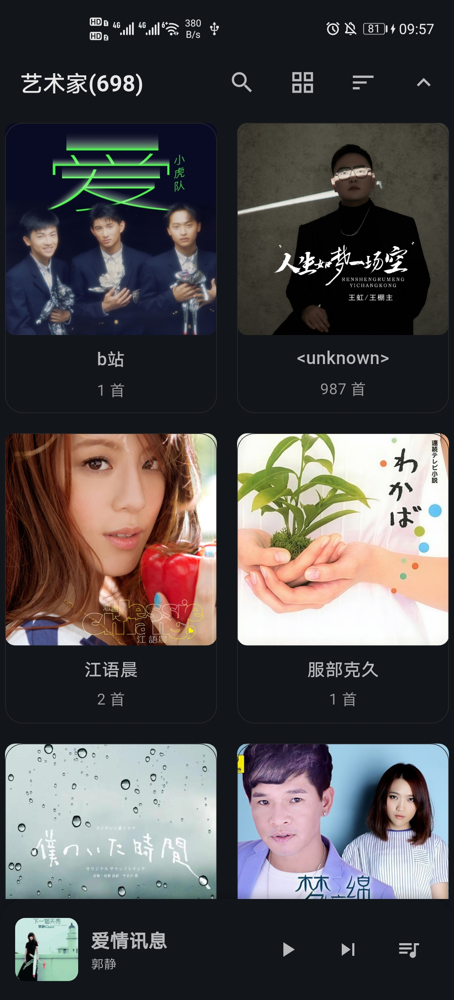
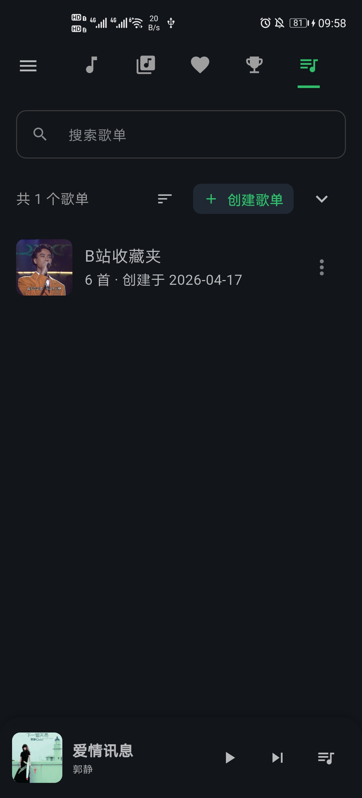
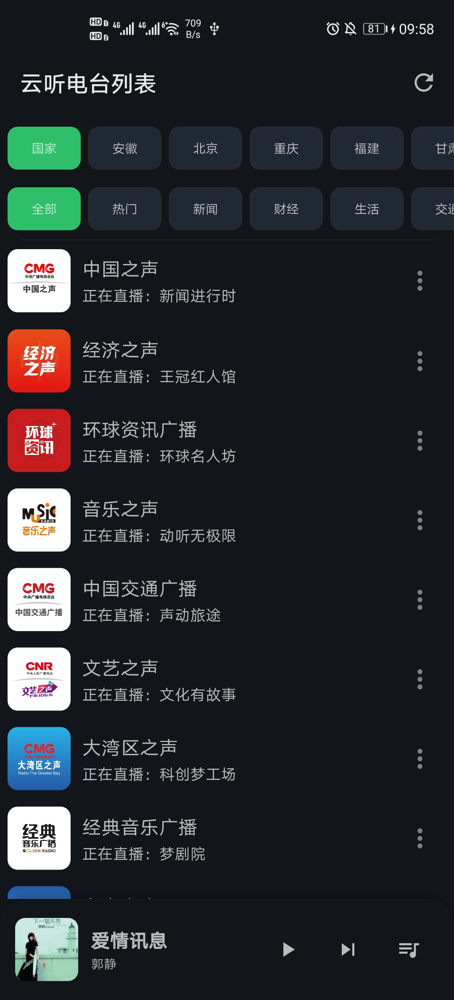
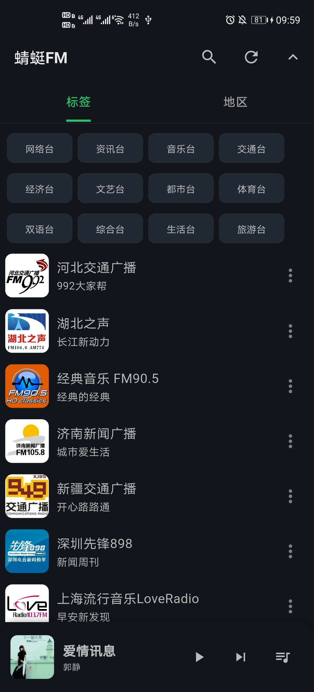
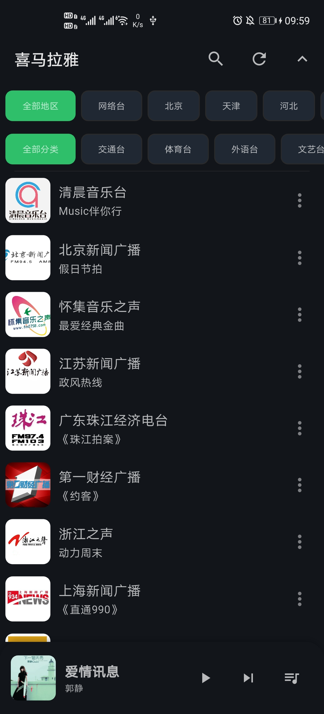
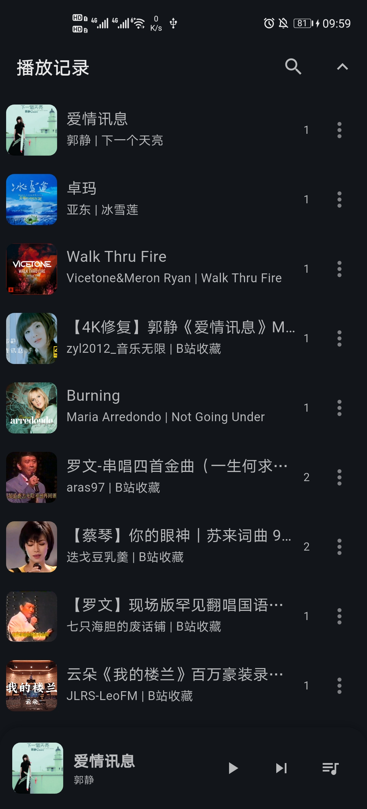
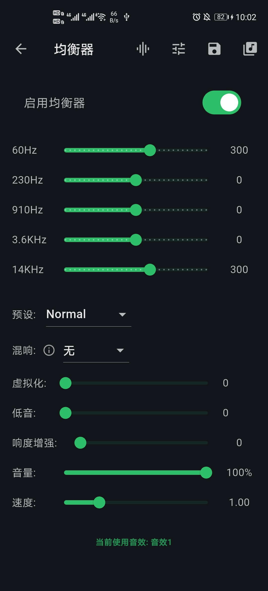
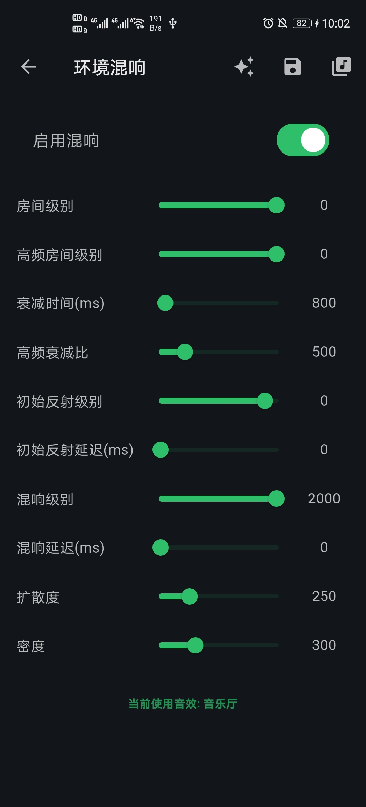
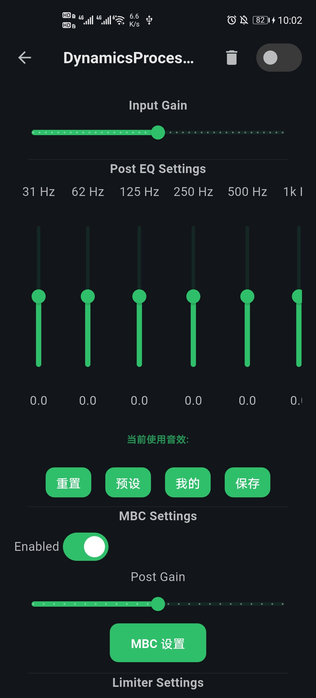
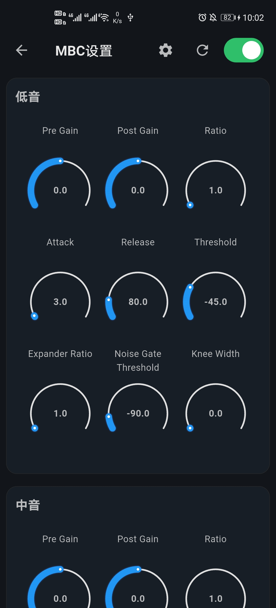
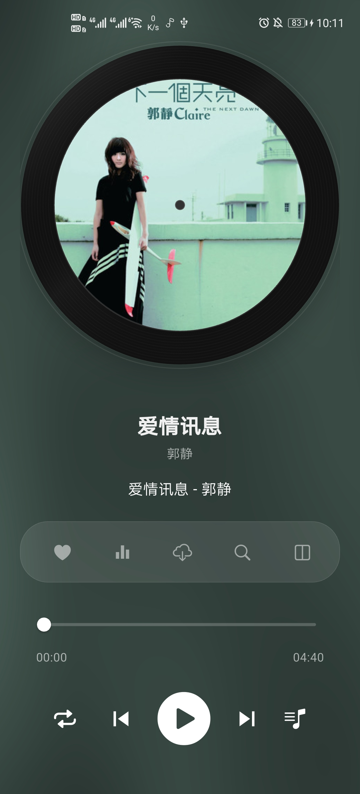

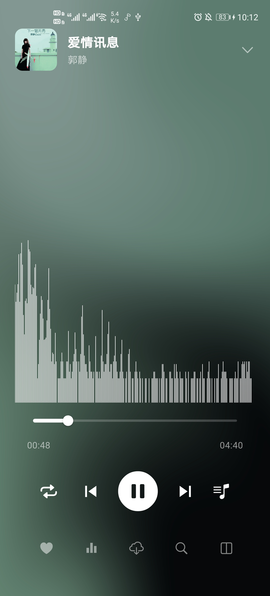
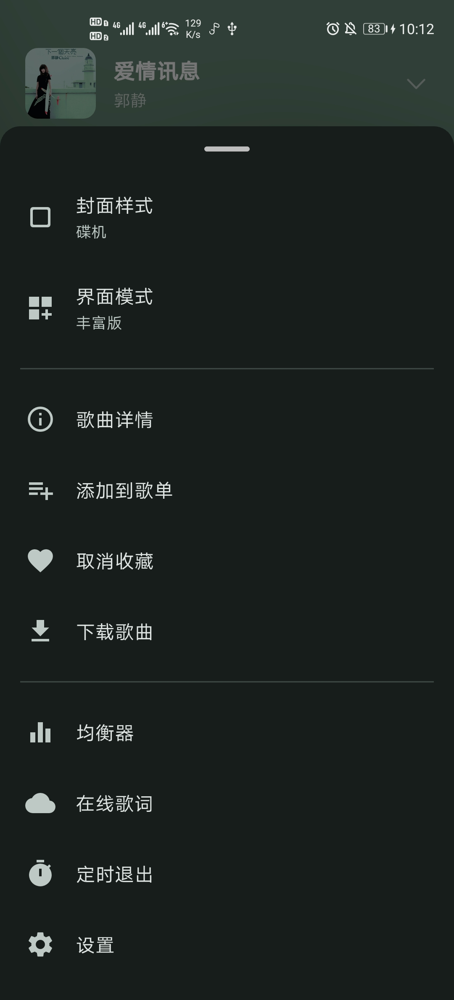
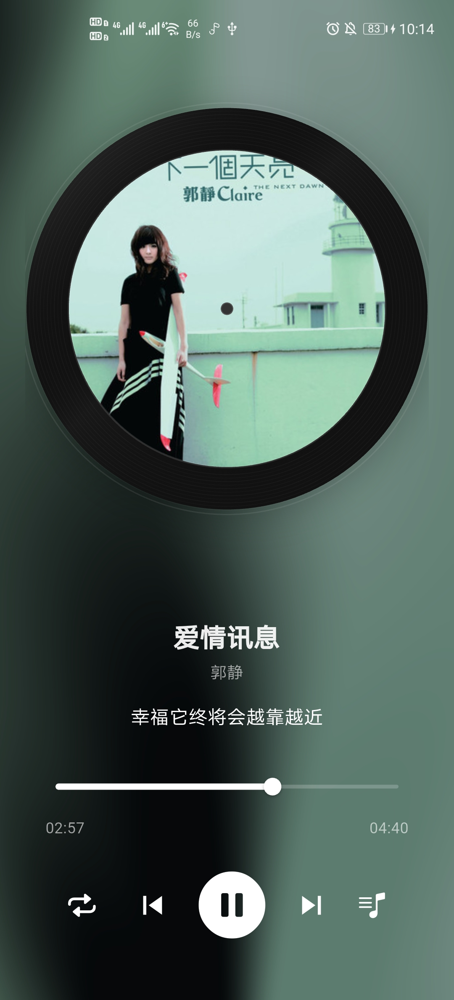

---

